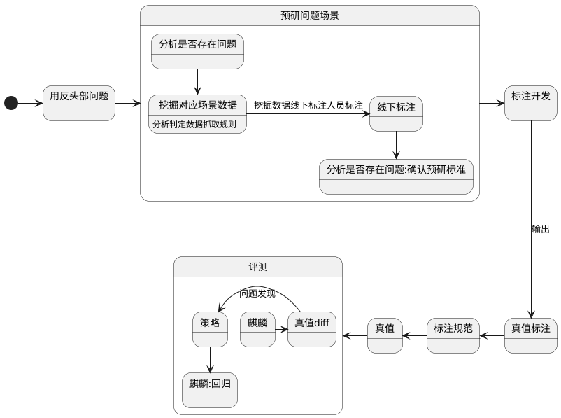
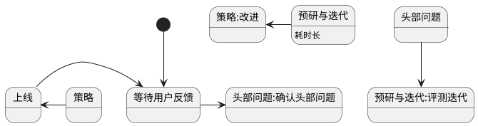
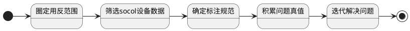
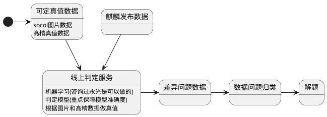

###当前迭代流程

###当前流程简化

从用户反馈问题到确定问题 然后要验证问题是否解决 就需要积累真值,而真值的获取是通过人工标注的方式一点一点慢慢积累,等真值ok后在修改判断策略ok否
那么如何缩短**预研与迭代**的时间

#####目前获取真值的方式是

####**<table><tr><td bgcolor=orange>此流程问题在用反问题是否真是伤害用户最大的不确定(很多问题不一定会上报),且获取真值和迭代流程长</td></tr></table>**

###理想流程(如以后有高精真值,则更容易适配)
####不要问题牵我们走,我们要牵着问题走

#####同时这套流程个人感想是也可以应用在事件体系上

##目前要做的
如何保障判定服务的模型准确度需要大量的真值来训练,
目前socol标注是通过标注一条link上的点来做为真值,但实际标注的时候标注人员是已经查看了设备的trace上下轨迹点(这些点都有图片)来判定要标注的点,trace信息如果能保留
可以对模型提高其判定准确度.
所以目前socol标注需要将标注人确定的信息都入库为真值.如何通过高效的方式保存目前确定的真值但是没入库的点可以商讨确定, 虽然会降低目前标注link的效率,但是重要的是积累了连续真值数据,能很大提升模型的准确度,且对长期评测发挥积极作用
###后续要做的
搭建判定服务模型
